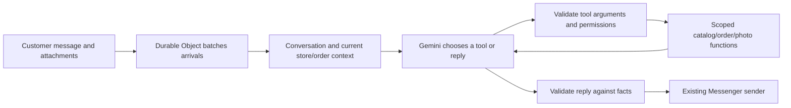

# Gemini conversation and tools

Production uses `gemini-3.5-flash-lite` as a native function-calling agent through the existing Cloudflare Google AI Studio gateway and stored provider key. Gemini interprets English, Bangla and Banglish from the current message, recent conversation, Facebook name, seller settings, saved draft and actual recent orders. Checkout state is context; it does not route every message to a fixed question.

## Research and design choice

[Google's function-calling guidance](https://ai.google.dev/gemini-api/docs/function-calling) recommends clear descriptions, typed parameters, a focused tool set, validated execution and returning tool results for subsequent decisions. The app exposes 18 scoped functions. It uses the [GenerateContent API's native function calls and responses](https://ai.google.dev/api/generate-content), retaining opaque thought signatures and function-call IDs across tool rounds. A final response can be ordinary model text or a `respond_to_customer` call carrying language metadata.

[Cloudflare's Google AI Studio provider route](https://developers.cloudflare.com/ai-gateway/usage/providers/google-ai-studio/) supports the native provider API and stored keys. The app keeps its existing Workers AI gateway binding and Durable Object message coordinator, so this change needs neither a second Google credential nor a framework/database migration.

## Tool coverage

| Capability                  | Tools                                                                            |
| --------------------------- | -------------------------------------------------------------------------------- |
| Catalog and stock           | `browse_catalog`, `search_products`, `get_product_details`                       |
| Store policies and delivery | `get_store_policy`, `get_delivery_options`                                       |
| Customer and orders         | `get_order_context`, `get_order_status`                                          |
| Images                      | `match_customer_image`, `show_product_photos`                                    |
| Checkout                    | `start_order_draft`, `update_order_draft`, `add_order_item`, `remove_order_item` |
| Order completion            | `request_order_confirmation`, `confirm_order`, `cancel_order`                    |
| Conversation                | `request_human_handoff`, `respond_to_customer`                                   |

Gemini chooses a configured delivery-zone ID by meaning. There is no production alias regex converting customer phrases into zones. Contact details can arrive together, in any order; valid fields are retained when another field is invalid. Photo tools queue actual catalog attachments rather than only saying that a photo will be sent.

## Server responsibilities

The model cannot choose a workspace, access arbitrary SQL/URLs, set prices, bypass stock limits or execute code. Tools validate tenant ownership, active Page/AI settings, schemas, current inbound evidence and canonical product/zone IDs. Phone format and other structural validation remain deterministic; these checks do not interpret intent.

Confirmation needs a complete summary actually sent to this customer, a matching review hash, a later inbound message and an independent semantic approval check. The database still enforces atomic order snapshots, idempotent confirmation and stock changes. Questions asking whether an order is confirmed cannot supply consent. Complete summaries and confirmation receipts are rendered by code to preserve their evidence.

Normal replies undergo a semantic check against context and successful tool results before sending. Invalid tool arguments return structured errors for Gemini to correct. The loop allows at most eight rounds and twenty tool calls, with within-turn deduplication of identical draft mutations. Existing database order idempotency and Durable Object batch/delivery IDs remain in place. The loop is not a claim of exactly-once execution across arbitrary infrastructure failures.

No production phrase classifier or fixed checkout-question router runs. `mock-orchestrator.ts` and the older helpers remain for deterministic offline fixtures; `APP_MODE=mock` is intentionally not a live-model simulation. Product indexing, image-byte validation, phone validation and transport security can still use structural text/format checks.

## Validation and operation

Integration tests exercise the production agent loop using controlled Gemini function-call responses, with real local D1 tool execution. They cover browsing during checkout, signature/result round trips, zone IDs, profile consent, partial field failures, tenant isolation, confirmation/status separation, invalid-call recovery and the greeting path. Live probes use the real Gemini gateway with synthetic store/customer context and never send Messenger messages.

A missing `settings` import in the tool executor caused the first call to throw before responding, including greetings. The import is fixed. Failure logs now report a safe stage, tool and error type without dumping customer text or provider payloads. `npm run deploy:production` now runs TypeScript validation before building or uploading.
